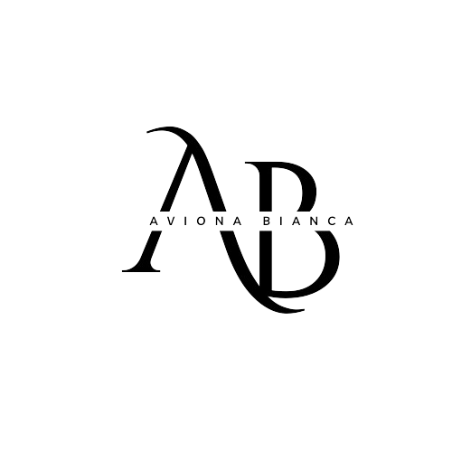

<a name="readme-top">

<br/>

<br />
<div align="center">
  <a href="https://github.com/zyx-0314/">
    
  </a>

  <h3 align="center">Final project</h3>
</div>

<div align="center">
 A compilation of past projects and showcase of my skills and experience with Web Development.
</div>

<br />


---

<br />
<br />


<details>
  <summary>Table of Contents</summary>
  <ol>
    <li>
      <a href="#overview">Overview</a>
      <ol>
        <li>
          <a href="#key-components">Key Components</a>
        </li>
        <li>
          <a href="#technology">Technology</a>
        </li>
      </ol>
    </li>
    <li>
      <a href="#rule,-practices-and-principles">Rules, Practices and Principles</a>
    </li>
    <li>
      <a href="#resources">Resources</a>
    </li>
  </ol>
</details>

---

## Overview


<!-- The following are just sample -->
Description of the project in details.

Guiding Question:
- What is the project? This project is about making our own website or portfolio compiling all of our past hands on and seatworks in Web designing.

- Whats the purpose? The purpose of this project is to showcase what we gained knowledge, skills and experience on Web designing. 

### Key Components
<!-- TODO: List of Key Components -->
<!-- The following are just sample -->
- MultiPage Website
- Hover Effect
- Cards animation

### Technology
<!-- TODO: List of Technology Used -->


## Rules, Practices and Principles
1. Always use `WD-` in the front of the Title of the Project for the Subject followed by your custom naming.
2. Do not rename any .html files; always use `index.html` as the filename.
3. Place Files in their respective folders.
4. All file naming are in camel case.
   - Camel case is naming format where there is no white space in separation of each words, the first word is in all lower case while the succeding words first letter are in upper followed by lower cased letters.
   - ex.: buttonAnimatedStyle.css
5. Use only `External CSS`.
6. Renaming of Pages folder names are a must, and relates to what it is doing or data it holding.
7. File Structure to follow below.

```
WD-ProjectName
└─ assets
|   └─ css
|   |   └─ style.css
|   └─ img
|   |   └─ fileWith.jpeg/.jpg/.webp/.png
|   └─ js
|       └─ script.js
└─ pages
|  └─ pageName
|     └─ assets
|     |  └─ css
|     |  |  └─ style.css
|     |  └─ img
|     |  |  └─ fileWith.jpeg/.jpg/.webp/.png
|     |  └─ js
|     |     └─ script.js
|     └─ index.html
└─ index.html
└─ readme.md
```

## Resources

<!-- TODO: Add References -->
| Title | Purpose | Link |
|-|-|-|
|Canva|use to edit prototype for design ideas|https://www.canva.com/|
|Youtube|Get some card design ideas for contact pages|https://www.youtube.com/results?search_query=contact+page|
|Responsive CSS Cards with Hover Overlay Animation|Get some card design ideas|https://youtu.be/c-6XRnYHbkw?si=e119AOUA_W7eo_YY|
|Google Fonts|Used to get Different font styles|https://fonts.google.com/|
|Css.gg|used to get icons |https://css.gg/|
|Pinterest|Get photos for background|https://ph.pinterest.com/pin/787355947381928979/|

## Wakatime
https://wakatime.com/@018f0316-294f-4b38-b869-a3201b1c8b64/projects/jcuppksrbz?start=2024-07-09&end=2024-07-15 